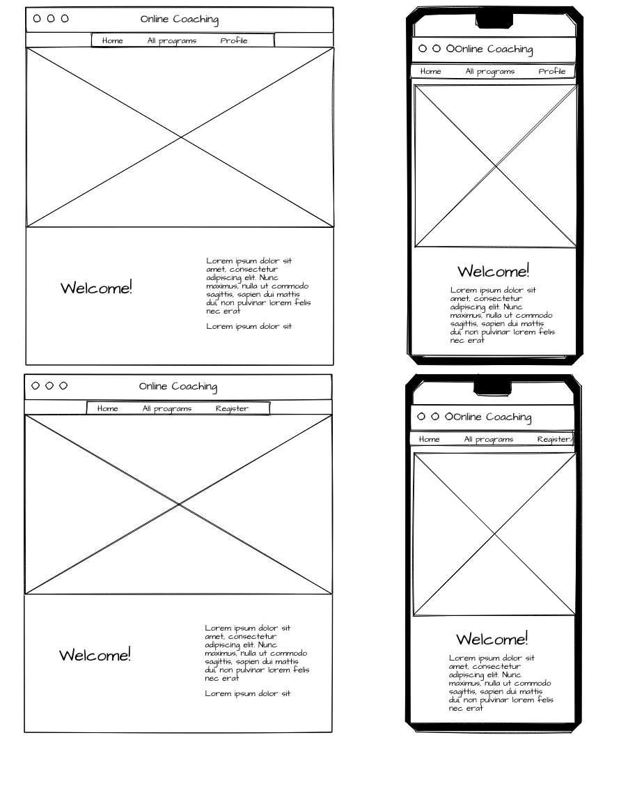
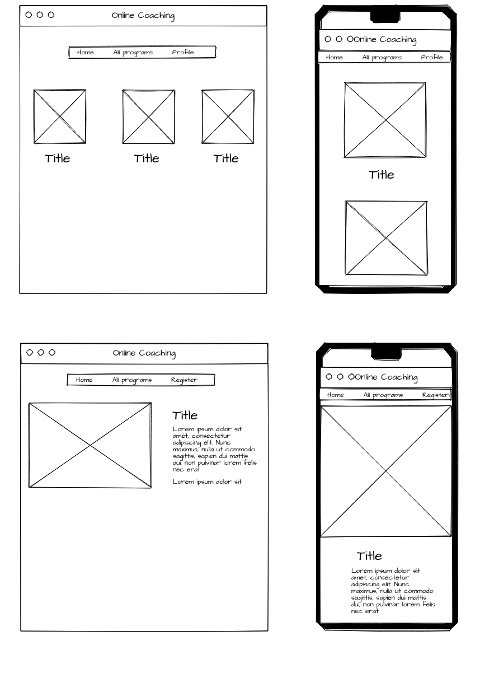
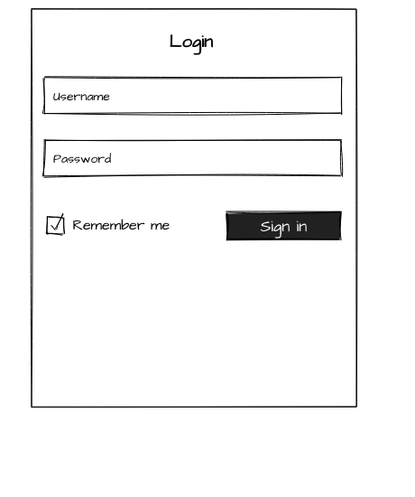
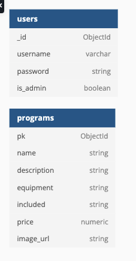
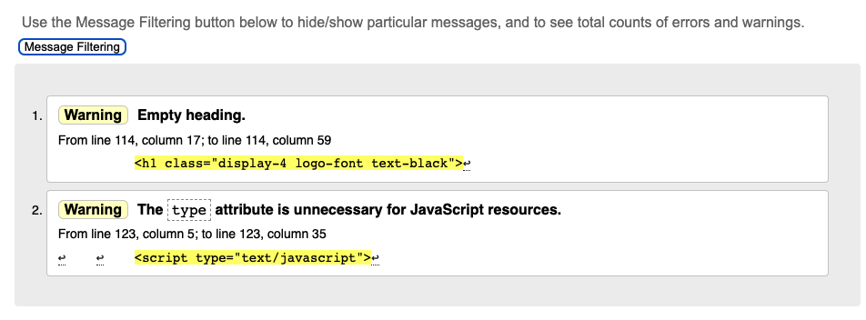
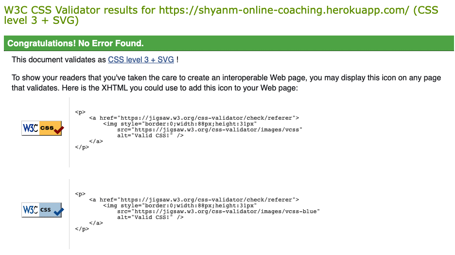
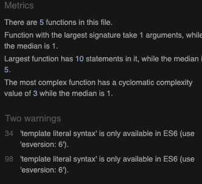

You can find a link to the live website [here](https://shyanm-online-coaching.herokuapp.com/).

# Online Coaching

The aim of this project is for the fitness coach to sell their programs.

## <ins> Contents </ins>
1. UX
    * Customer Goals
    * Business Owner Goals
    * User Stories
    * Design Choices
    * Wireframes
      
2. Database Design
3. Technologies used
4. Testing
5. Deployment
6. Credits
    * Content
    * Code
    * Acknowledgements

## 1. UX

### Customer Goals

View the program, choose one and buy it.

### User Stories

As a customer I want:
- To be able to view the the page and navigate through the site easily.
- Easily go back to the home page.
- Easily find the programs.
- Be able to register, login or log out.
- be able to add the program to a bag.
- be able to be able to view the items in the bag and edit them.
- Be able to check out securely

### Design Choices

The design is very simple as I was focusing on the website building.

### Wireframes

## 2. Database Design

- 

## 3. Technologies used

### Languages, Frameworks, Libraries and Programs used

- HTML5
- CSS3
- Javascript
- Python
- Django
- SQLite
- PostgreSQL
- jQuery
- Git
- Github
- Gitpod
- Heroku
- AW
- Stripe

## 4. Testing

### User Stories
- To be able to view the the page and navigate through the site easily.
    - Site is easy to navigate.
- Easily go back to the home page.
    - The user can click on the online coaching title to go back home.
- Easily find the programs.
    - Link to the programs sends the user to the programs page, were all programs can be viewed.
- Be able to register, login or log out.
    - Registration, login and logout have been tested and work.
- be able to add the program to a bag.
    - each program has an add to basket, which works.
- be able to be able to view the items in the bag and edit them.
    - The bag page shows the item added, you can add aditional items or delete an item. 
- Be able to check out securely
    - stripe has been set up to provide secure checkouts.

- 
- 
- 

## 5. Deployment and Cloning

To view the deployed version of this website:

### Github
Click on the Online coaching repository in Github.
Click on the Gitpod button to copy to your profile.

Heroku Deployment with AWS

- Install gunicorn, psycopg2-binary and dj-database-url using the PIP Install command.
- Freeze all the requirements for the project into a requirements.txt file using the pip3 freeze > requirements.txt command.
- Create a procfile, with the following inside it: web: gunicorn pjc_plant_services_ms4.wsgi:application
- Push these changes to GitHub, using git add . git commit -m and git push commands.
- Navigate to Heroku, and login or create an account.
- Once logged in, click on 'resources'.
- From the add-ons search bar, add the Heroku Postgres DB, select the free account, and then submit order form to add it to the project.
- From the app's dashboard, click on 'settings', and then 'reveal config vars' in order to set the necessary configuration variables for the project. 

## 6. Credits

### Content

Content was used from this website : https://michellemcdaniel.net

### Code

- The main set up was done with the aid of Code Institute lessons for Boutique Ado.

* General

    * [Bootstrap](https://getbootstrap.com)
    * [W3Schools](https://www.w3schools.com) 
    * [CSS tricks](https://css-tricks.com)
    * [Stack Overflow](https://stackoverflow.com/) 

